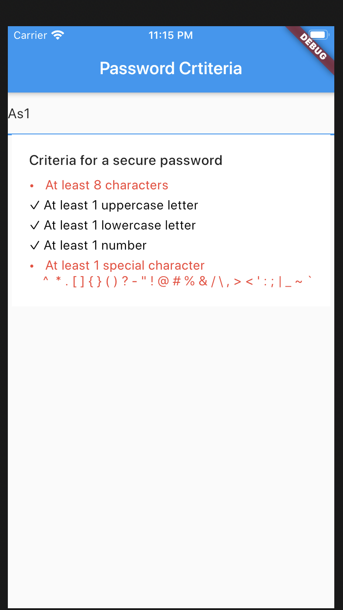

# password_criteria

## Getting Started

# A new Flutter plugin for password criteria

Current version (0.1.1) Bug Fixes and clean code

This package returns a container view which is having 5 criteria in Red color.

#criteria
1. At least one lower case
2. At least on upper case
3. At least One number
4. one special character
5. Minimum 8 character

When one starts typing & the password starts meeting the criterion specified,
the corresponding/respective criterion turns black in color.
It ie a very useful library for signup forms & change password forms